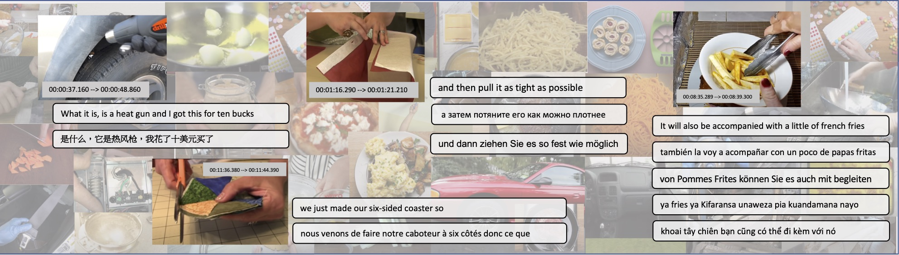

# Multi-HT100M

## Multilingual captions for the HowTo100M dataset

We provide the multilingual captions for the HowTo100M dataset in the following languages:
Language | code | link
-------- | ---- | ----
Englsish | en | [link](https://drive.google.com/file/d/18laatk-auBtb_2mdgsidU1Jb7FiBY0oT/view?usp=sharing)
German | de | [link](https://drive.google.com/file/d/1SsK39rx9HoD3hf8gcxH91NPekDvHrBDy/view?usp=sharing)
French | fr | [link](https://drive.google.com/file/d/1z_of1BMSL6_XvhYa8hK6VPdMf4c2QxZb/view?usp=sharing)
Czech | cs | [link](https://drive.google.com/file/d/1ur275nrwgfnV-yT5qOCuHsLWfGu--HUU/view?usp=sharing)
Swahili | sw | [link](https://drive.google.com/file/d/1ECWbgifgtIWveNmsaou8ux5Ybkln8ObG/view?usp=sharing)
Russian |ru | [link](https://drive.google.com/file/d/1JAC820K8dK-_25N1EXMTZMBCs0Ms_DpB/view?usp=sharing)
Vietnamese | vi | [link](https://drive.google.com/file/d/1Bx00cWiyf-ZS_Gcnn0BSHz87P5lzLU21/view?usp=sharing)
Spanish | es | [link](https://drive.google.com/file/d/1-9mUTpkMovXNo5eoQM4wMNH2yQlaGlAD/view?usp=sharing)
Chinese | zh | [link](https://drive.google.com/file/d/1k9pO_qRC945TempvWfL6IM0IDYdeMbdZ/view?usp=sharing)

## Format
The how2_[lang].json file contains the captions for the HowTo100M videos. It can be read into a python dictionary where video_id as the key. Each value of the dictionary is another dictionary with the keys ['text', 'start', 'end']. The value of 'text' is a list of all the captions from the given video_id, and 'start' and 'end' are arrays correspondings to the start and end time timestamp of the captions (in second).

## HowTo100M videos
Please refer to [here](https://github.com/antoine77340/howto100m) for the list of HowTo100M videos and the video meta data 

## VTT in 9 Languages
The translated VTT in 9 languages for evaluation is available [here](https://drive.google.com/file/d/1RcFY8VHlJ6lrEqaCckn2umJeMweHFMmT/view?usp=sharing)

## Citation
'''
@inproceedings{huang2021multilingual,
  title={Multilingual Multimodal Pre-training for Zero-Shot Cross-Lingual Transfer of Vision-Language Models},
  author={Huang, Po-Yao and Patrick, Mandela and Hu, Junjie and Neubig, Graham and Metze, Florian and Hauptmann, Alexander G},
  booktitle={Proceedings of the 2021 Conference of the North American Chapter of the Association for Computational Linguistics: Human Language Technologies},
  pages={2443--2459},
  year={2021},
  url = {https://arxiv.org/abs/2103.08849},
}
'''

## Contact 
Please feel free to contact Bernie Huang (poyaoh@cs.cmu.edu or berniebear@gmail.com) if you have any questions. Thanks for your interest!
